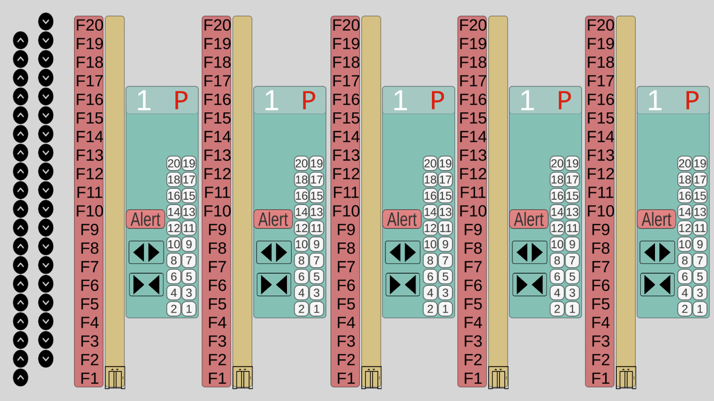
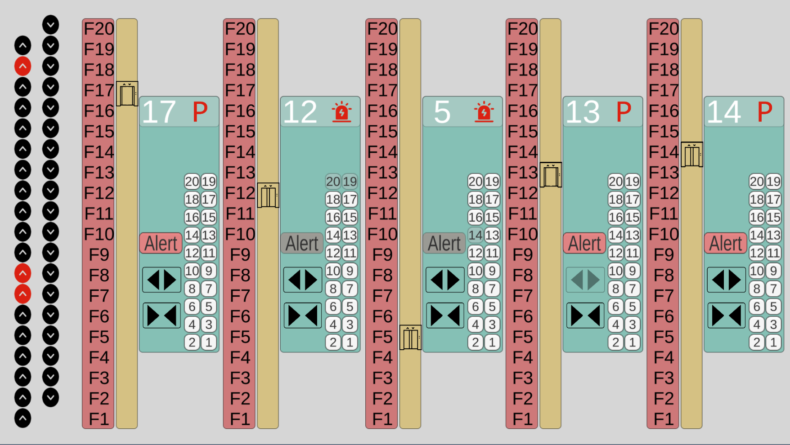
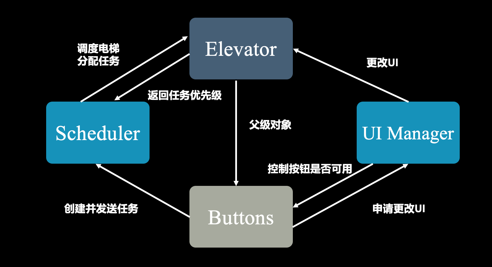

# 同济大学2023春 操作系统课程设计-电梯调度

## 项目结构

```
Project1-Elevator
├── Elevator Scheduling # 项目资源
│   └── Assets
│       ├──Prefabs   # Unity预制体
│       ├──Resources # 游戏资源
│       └──scripts   # C#脚本    
├── ElevatorScheduling-win
│   ├── ElevatorScheduling.exe #windows可执行文件
│   └── ...
├── ElevatorScheduling-mac.app   # macOS 应用程序
├── img      
└── README.md
```

## 基本任务

- 通过控制电梯调度，模拟进程调度，实现多线程编程和调度算法。

- 某一层楼20层，有五部互联的电梯。基于线程思想，编写一个电梯调度程序。

- 电梯应有一些按键，如：数字键、关门键、开门键、上行键、下行键、报警键等；

- 有数码显示器指示当前电梯状态；

- 每层楼、每部电梯门口，有上行、下行按钮、数码显示。
- 五部电梯相互联结，即当一个电梯按钮按下去时，其它电梯相应按钮同时点亮，表示也按下去了。
- 电梯调度算法：
  - 所有电梯初始状态都在第一层；
  - 每个电梯没有相应请求情况下，则应该在原地保持不动；
  - 电梯调度算法自行设计。

## 开发和运行环境

- 开发平台：Unity 2021.3.17f1c1 LTS
- 开发语言：C# (.NET version 6.0.301)
- 运行环境：Windows/macOS（运行可执行文件无需安装依赖）

## 运行方法

clone项目至本地

```shell
git clone git@github.com:tju2050633/OperatingSystem.git
```

Windows:

进入/OperatingSystem/Project1-Elevator/ElevatorScheduling-win/，双击打开Elevator Scheduling.exe。

macOS：

进入/OperatingSystem/Project1-Elevator/，双击打开ElevatorScheduling-mac.app。

## 运行截图



<center>初始状态<center/>



<center>运行状态<center/>


## 架构设计




本项目基于Unity和C#开发，整体设计模式为面向对象的，主要对象为：

- 电梯Elevator：核心的任务处理机，是多个任务进程需要抢占的资源，可以并行地进行移动等动作。电梯的不断移动即处理任务的过程，电梯不断接受来自调度器分配的任务，同时通过返回任务优先级帮助调度器进行电梯调度。电梯是主要的GUI组件，UI管理器主要针对电梯内的一系列子对象进行UI更改。GUI中，电梯具有以下子对象：可上下移动、开门关门的Sprite，楼层按钮、开关门按钮、报警按钮，电梯面板（显示当前楼层和电梯所处状态），楼层标签等等。
- 调度器Scheduler：专门处理电梯调度和任务分配的对象，不具有GUI组件。调度器接受来自界面上所有按钮创建和发送的任务，调度器从电梯对象获取该任务的优先级，并计算出任务优先级最高的电梯，将该任务分配给该电梯，达到优化电梯调度、节约任务处理时间的目的。
- UI管理器UI Manager：专门进行GUI更改的对象，自身不具有GUI组件。UI管理器监听按钮点击事件和电梯运行状态，并即时更改GUI（同时管理按钮是否可用）。例如，按钮点击后，UI管理器需要将其颜色变淡，并禁用该按钮，以表示按钮已经激活；电梯到达或停靠某楼层后，UI管理器需要更新电梯面板上的楼层显示和电梯状态。
- 各类按钮Buttons：如电梯外部的上行按钮、下行按钮，电梯内部的楼层按钮、报警按钮、开门按钮、关门按钮。上行/下行/楼层按钮会创建新任务，并发送给调度器去分配给电梯；报警按钮、开门/关门按钮一方面改变电梯对象的内部状态（如报警状态、停靠状态），控制电梯的运行，另一方面向UI管理器申请更改UI界面，如电梯面板显示报警、按钮自身变为灰色且不可用等。

## 核心代码说明

1. 多线程编程

   Unity中所有游戏对象都处于主线程上运行，由引擎自动调度达到并行的效果，因此多部电梯同时运行不需要在C#脚本中显式创建多个线程。

   但Unity提供了协程Coroutine功能，可以在后台执行某些任务，防止阻塞主线程。协程和线程都是处理并发任务的技术，但协程是程序内部调度的一种轻量级线程，只能在单个线程中运行，且只能串行执行多个任务。协程适用于频繁IO操作。本项目中使用协程创建定时器函数CancelAlertCoroutine和CancelOpenCoroutine，将计时放在后台执行，防止阻塞主线程。

   ```c#
   // AlertBtn.cs
   
   void onClick()
   {
     	...
       // 5s后，警报解除
       StartCoroutine(CancelAlertCoroutine(id));
   }
   
   private IEnumerator CancelAlertCoroutine(int id)
   {
       yield return new WaitForSeconds(5f); // 延迟 5 秒
       // 取消报警状态
       scheduler.SetAlert(id, false);
       // 将报警按钮设置为可用
       uiManager.SetInnerBtnActive(id, "Alert", false);
   }
   ```

   ```c#
   // OpenBtn.cs
   
   void onClick()
   {
       ...
       // 3s后自动解除停靠状态、关门
       StartCoroutine(CancelOpen(id));
   }
   
   IEnumerator CancelOpenCoroutine(int id)
   {
       yield return new WaitForSeconds(3f);
   
       // 如果开门按钮为可用状态，说明已经被关门按钮取消了
       if (btn.GetComponent<Button>().interactable == false)
       {
           // 设置电梯为非停靠状态
           scheduler.SetOpen(id, false);
           // 设置图像为关门
           uiManager.SetElevImage(id, "Elevator");
           // 将开门按钮设置为可用
           uiManager.SetInnerBtnActive(id, "Open", false);
       }
   }
   ```

   

2. 互斥锁

   电梯是本项目中的核心处理机资源，是内外按钮创建的众多任务争抢的对象。每次涉及电梯调度、任务分配以及更改UI，都要对电梯对象内的变量进行读写操作。为保证程序稳定运行，需要使用C#线程库中的互斥锁对象Mutex对变量进行保护。

   

   在电梯类中，为关键成员变量的set/get接口（以及电梯内部任务列表的添加任务、移除任务接口）添加互斥锁的获取、释放两行代码，从而确保电梯同时接受多个外界读写操作时不发生冲突。

   

   ```c#
   // Elevator.cs
   
   private Mutex mutex = new Mutex();
   
   /* ----------使用mutex保护的电梯属性get/set方法---------- */
   
   public void setAlerting(bool alerting)
   {
       mutex.WaitOne();
       this.alerting = alerting;
       mutex.ReleaseMutex();
   }
   
   public bool getAlerting()
   {
       mutex.WaitOne();
       bool value = alerting;
       mutex.ReleaseMutex();
       return value;
   }
   
   public void setParking(bool parking)
   {
       mutex.WaitOne();
       this.parking = parking;
       mutex.ReleaseMutex();
   }
   
   public bool getParking()
   {
       mutex.WaitOne();
       bool value = parking;
       mutex.ReleaseMutex();
       return value;
   }
   
   public void setDirection(int direction)
   {
       mutex.WaitOne();
       this.direction = direction;
       mutex.ReleaseMutex();
   }
   
   public int getDirection()
   {
       mutex.WaitOne();
       int value = direction;
       mutex.ReleaseMutex();
       return value;
   }
   
   public void setFloor(int floor)
   {
       mutex.WaitOne();
       this.floor = floor;
       mutex.ReleaseMutex();
   }
   
   public int getFloor()
   {
       mutex.WaitOne();
       int value = floor;
       mutex.ReleaseMutex();
       return value;
   }
   
   public void insertTask(int priority, int task_floor)
   {
       mutex.WaitOne();
       innerTasks.Insert(priority, task_floor);
       mutex.ReleaseMutex();
   }
   
   public void removeTask(int task_floor)
   {
       mutex.WaitOne();
       innerTasks.Remove(task_floor);
       mutex.ReleaseMutex();
   }
   
   /*-----------------------------------------------------*/
   ```

3. 调度算法

   电梯调度算法主要由电梯和调度器协作完成。其中电梯会计算新任务分配给自身时，该任务的优先级；调度器会根据该优先级，选择优先级最高的电梯分配任务。

   

   优先级计算算法如下：电梯内部有一个任务列表，每个元素代表楼层，电梯按顺序依次经过每个楼层，当需要添加新任务时，算法计算在原有列表确定的多段路径（由路径两端的楼层号与电梯运行方向决定）中，新任务刚好处于哪一段路径上（新楼层在路径两端之间，且新任务的方向和路径方向一致）。若找到了这样的路径，则新任务插入该路径两端楼层之间；若找不到，则新任务添加到列表末尾。新任务的优先级就是添加进列表后的索引号。

   

   调度器选择电梯时，对每个电梯调用该算法，得到优先级最高（值最小）的电梯，对其分配该任务。如果多个电梯优先级相同，则优先选择距离更近的电梯。此外，调度器会排除正在报警的电梯，但若所有电梯都在报警，则按正常情况调度。

   

   ```c#
   // Elevator.cs
   
   /*
   * 计算任务优先级
   */
   public int CalcTaskPriority(int task_floor, int task_direction)
   {
       // task_direction为0，说明是内部任务，电梯经过该楼层
       // task_direction为1，任务指定上行，task_direction为-1，任务指定下行
       bool up_or_pass = task_direction >= 0;
       bool down_or_pass = task_direction <= 0;
   
       for (int i = 0; i < innerTasks.Count; i++)
       {
           // 计算电梯移动路径两端的楼层
           int last_floor = i == 0 ? getFloor() : innerTasks[i - 1];
           int next_floor = innerTasks[i];
   
           // 检查电梯任务列表，计算目标任务是否在电梯移动路径两端的楼层之间
           if (last_floor < next_floor && up_or_pass && task_floor >= last_floor && task_floor < next_floor
           || last_floor > next_floor && down_or_pass && task_floor <= last_floor && task_floor > next_floor)
           {
               return i;
           }
       }
   
       // 若没有找到合适的位置，则优先级排最低
       return innerTasks.Count;
   }
   ```

   

   ```c#
   // Scheduler.cs
   
   /**
   * 计算任务分配给哪个电梯
   * @param floor 楼层
   * @param direction 方向：1上，-1下
   */
   public int CalcProperElev(int task_floor, int task_direction)
   {
     // 检查是否5个电梯都在报警
     bool all_alerting = elevators[0].getAlerting() && elevators[1].getAlerting() && elevators[2].getAlerting() && elevators[3].getAlerting() && elevators[4].getAlerting();
   
     // 遍历5个电梯，求出优先级最高的电梯id
     int id = 0, min_prio = Int32.MaxValue;
     foreach (Elevator elev in elevators)
     {
         // 如果不是5个都在报警，则排除正在报警的电梯
         if (!all_alerting && elev.getAlerting())
             continue;
   
         // 计算优先级
         int prio = elev.CalcTaskPriority(task_floor, task_direction);
   
         // 更新条件：优先级更高，或者优先级相同但距离更近
         if (prio < min_prio || (prio == min_prio && id != 0 && Math.Abs(elev.getFloor() - task_floor) < Math.Abs(elevators[id - 1].getFloor() - task_floor)))
         {
             min_prio = prio;
             id = elev.id;
         }
     }
   
     return id;
   }
   ```
   
   

​	
