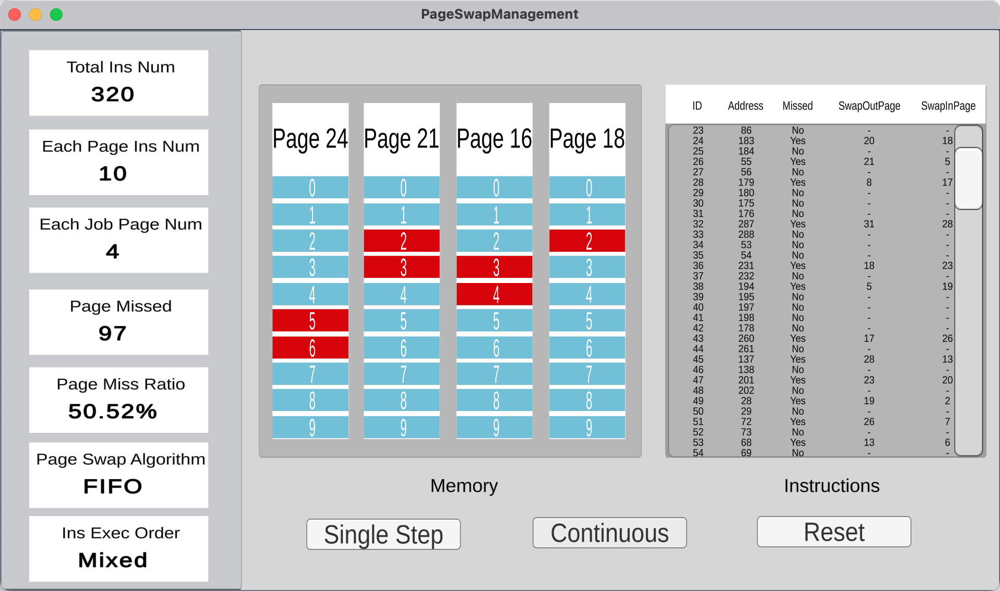
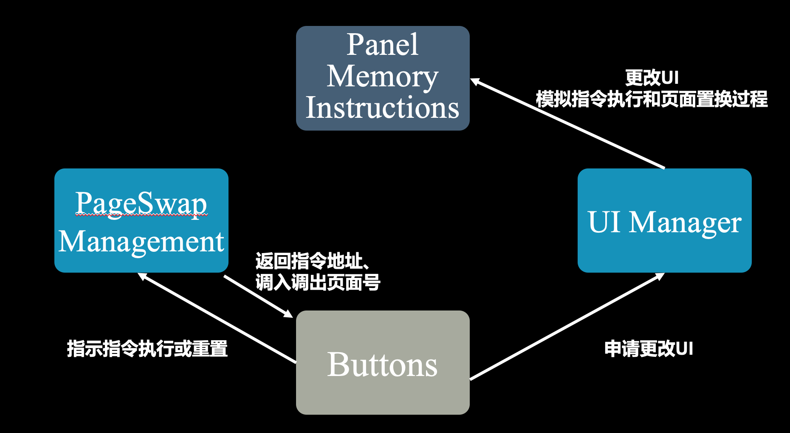

# 同济大学2023春 操作系统课程设计-内存管理

## 项目结构

```
Project2-PageSwapManagement
├── PageSwapManagement # 项目资源
│   └── Assets
│       ├──Prefabs   # Unity预制体
│       ├──Resources # 游戏资源
│       └──scripts   # C#脚本    
├── PageSwapManagement-win
│   ├── PageSwapManagement.exe #windows可执行文件
│   └── ...
├── PageSwapManagement-mac.app   # macOS 应用程序
├── img      
└── README.md
```

## 基本任务

- 假设每个页面可存放10条指令，分配给一个作业的内存块为4。模拟一个作业的执行过程，该作业有320条指令，即它的地址空间为32页，目前所有页还没有调入内存。

- 在模拟过程中，如果所访问指令在内存中，则显示其物理地址，并转到下一条指令；如果没有在内存中，则发生缺页，此时需要记录缺页次数，并将其调入内存。如果4个内存块中已装入作业，则需进行页面置换。

- 所有320条指令执行完成后，计算并显示作业执行过程中发生的缺页率。


## 核心算法

- **置换算法：FIFO**

  - 计算当前执行所在页面号和页内偏移
  - 若内存有该页面，则执行该指令
  - 若内存无该页面，且有空闲内存块，则将页面调入内存，页面号加入队列
  - 若内存无该页面，且无空闲内存块，则通过先进先出算法置换页面，调出在内存中存在最久的页面，置换为目标页面

- **模拟指令访问算法：混合执行**
  - 在0－319条指令之间，随机选取一个起始执行指令，如序号为m
  - 顺序执行下一条指令，即序号为m+1的指令
  
  - 通过随机数，跳转到前地址部分0－m-1中的某个指令处，其序号为m1
  
  - 顺序执行下一条指令，即序号为m1+1的指令
  - 通过随机数，跳转到后地址部分m1+2~319中的某条指令处，其序号为m2
  - 顺序执行下一条指令，即m2+1处的指令。
  - 重复跳转到前地址部分、顺序执行、跳转到后地址部分、顺序执行的过程，直到执行完320条指令。

## 开发和运行环境

- 开发平台：Unity 2021.3.17f1c1 LTS
- 开发语言：C# (.NET version 6.0.301)
- 运行环境：Windows/macOS（运行可执行文件无需安装依赖）

## 运行方法

clone项目至本地

```shell
git clone git@github.com:tju2050633/OperatingSystem.git
```

Windows:

进入/OperatingSystem/Project2-PageSwapManagement/PageSwapManagement-win/，双击打开PageSwapManagement.exe。

macOS：

进入/OperatingSystem/Project2-PageSwapManagement/，双击打开PageSwapManagement.exe-mac.app。

## 运行截图


<center>初始状态<center/>



<center>运行状态<center/>


## 架构设计




本项目基于Unity和C#开发，整体设计模式为面向对象的，主要对象为：

- GUI：Panel, Memory和Instructions，分别对应界面从左到右3个模块。Panel显示了页面页面和指令参数、置换算法、指令执行顺序算法，以及缺页数和缺页率。其中缺页数和缺页率在指令执行过程中实时更新。
- 页面置换管理器PageSwapManagement：实现算法的类，内部存储了页面队列、指令列表，管理了与算法相关的变量和参数，并提供执行算法的接口，如通过混合执行算法获取下一条指令地址、通过FIFO算法计算换出的页面号等。
- UI管理器UI Manager：专门进行GUI更改的对象，自身不具有GUI组件。UI管理器监听按钮点击事件，并即时更改GUI。例如，点击单步执行后，UI管理器添加一条新指令到右侧指令列表，接着用GUI的变化模拟内存中的页面调入调出，最后更新左侧面板的缺页情况。
- 3个按钮Buttons：对应界面上的Single Step, Continuous, Reset，分别为单步执行、连续执行（直到320条指令执行完毕），重置。按钮的点击事件调用了页面置换管理器的算法接口，如取得下一条指令的地址、计算页面号和页面偏移和决定调出的页面。

## 核心代码说明

1. 页面置换算法：FIFO实现 TODO

函数接受调入页号作为参数，并根据页面队列情况分为3种情况执行：

- 页面列表存在需要调入的页面，则不进行页面调入、调出，此时不发生缺页，更新缺页率后返回-1标志
- 页面列表不存在需要调入的页面，但内存未满（内存中页面数小于4），则不进行页面调出，进行页面调入，新调入的页面加入页面队列末尾，此时发生缺页，更新缺页率后返回-2标志
- 页面列表不存在需要调入的页面，且内存已满（内存中页面数为4），则进行页面调入和调出。按照FIFO算法，调出页面为队列头部队列，调入页面加入页面队列末尾，此时发生缺页，更新缺页率后返回调出页面的页号。

```c#
public class PageSwapManager : MonoBehaviour
{
  	// 页面队列，用于实现页面置换的FIFO算法
    private List<int> pageQueue = new List<int>();
  
  	// 缺页(率)
  	private int pageMissedNum = 0;
		private float pageMissedRate = 0;
    
  	// ...
  
  	// 页面置换管理器提供给按钮的获取换出页面页号的接口
  	// 利用队列实现页面需要置换时先入先出
    public int getPageOutNum(int pageNum)
    {
        // 如果页面列表存在该页面，不换出、不换入，返回-1
        if (pageQueue.Contains(pageNum))
        {
          	// 计算缺页(率)
            pageMissedRate = pageMissedNum * 100f / instructionExecuted;
            return -1;
        }
        // 如果页面列表未满且需要的页面不存在，换入、不换出，返回-2
        else if(pageQueue.Count < 4)
        {
            // 计算缺页(率)
            pageMissedNum += 1;
            pageMissedRate = pageMissedNum * 100f / instructionExecuted;
          
            pageQueue.Add(pageNum);
            return -2;
        }
        // 否则弹出队首页面，加入需要的页面，返回换出的页面号
        else
        {
            // 计算缺页(率)
            pageMissedNum += 1;
            pageMissedRate = pageMissedNum * 100f / instructionExecuted;
          
            int pageOutNum = pageQueue[0];
            pageQueue.RemoveAt(0);
            pageQueue.Add(pageNum);
            return pageOutNum;
        }
    }
}
```


2. 指令选取算法：混合执行 TODO

算法不接受参数，返回下一条要执行指令的地址，其多次执行过程中使用如下变量进行记录和标志。

其中next标志在每次顺序执行、非顺序执行后反置，达到50%指令顺序执行；up_down标志每次非顺序指令情况下，取前/后地址部分指令执行后反置，达到剩下50%指令中25%取前地址部分指令，25%取后地址部分指令。

依照指令混合执行思路，算法根据标志变量分为3种情况执行：

- 顺序执行：50%的情况下顺序执行，需满足标志next为true，且当前执行的指令下一地址有指令、且该指令未执行过，则返回该下一指令地址。
- 非顺序执行：不满足顺序执行条件时，为剩下50%情况的非顺序执行。此时按照up_down变量的值决定随机挑选指令范围的上、下界，即up_down为true时范围为m+1\~319，up_down为false时范围为0\~m-2。其中m是当前执行指令地址。若该范围内没有未执行过的指令，则从另一边随机挑选指令。

```c#
public class PageSwapManager : MonoBehaviour
{
    public List<bool> instructionList = new List<bool>();	// 记录320条指令是否执行
		private int instructionExecuted = 0;	// 已执行指令数
		private bool up_down = true;	// true时表示取后地址部分指令，false时表示取前地址部分指令，
		private int currentIns = -1;	// 当前执行指令的地址
		private bool next = false;	// true表示取顺序执行指令，false表示取前/后地址部分指令
  
    void Start()
    {
        // 指令列表初始化为320个false
        for (int i = 0; i < 320; i++)
        {
            instructionList.Add(false);
        }
    }
  
    // ...
  
  	// 页面置换管理器提供给按钮的获取下一条指令地址的接口
  	// 50%顺序执行，25%均匀分布在前地址部分，25%均匀分布在后地址部分
    public int getNextInstruction()
    {
        if (instructionExecuted == 320)
        {
            return -1;
        }
        // 若执行m + 1
        if (next && currentIns < 319 && instructionList[currentIns + 1] == false)
        {
            next = false;
            currentIns += 1;
            instructionList[currentIns] = true;
        }
        // 不执行m + 1，则轮流执行0～m-1和m+1～319
        else
        {
            next = true;
            int low, high;
            if (up_down)
            {
                low = currentIns + 1;
                high = 320;
            }
            else
            {
                low = 0;
                high = currentIns - 1;
            }
            up_down = !up_down;
            // 获取对应区间未执行的指令
            List<int> unexecuted = new List<int>();
            for (int i = low; i < high; i++)
            {
                if (instructionList[i] == false)
                {
                    unexecuted.Add(i);
                }
            }
            // 一边没有未执行的指令，则获取另一边的未执行指令
            if (unexecuted.Count == 0)
            {
                low = low == 0 ? currentIns + 1 : 0;
                high = high == 320 ? currentIns - 1 : 320;
                for (int i = low; i < high; i++)
                {
                    if (instructionList[i] == false)
                    {
                        unexecuted.Add(i);
                    }
                }
            }
            currentIns = unexecuted[Random.Next(0, unexecuted.Count)];
            instructionList[currentIns] = true;
        }
        instructionExecuted += 1;
        return currentIns;
    }
}
```

