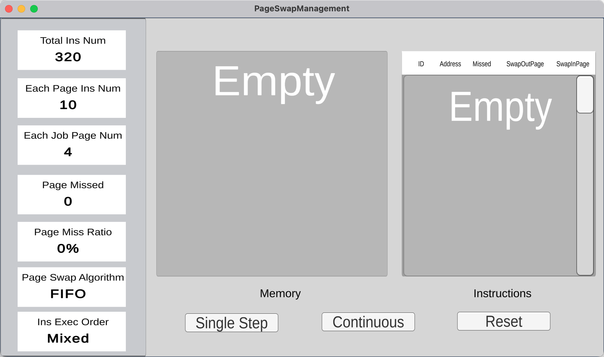

# 同济大学2023春 操作系统课程设计-内存管理

## 项目结构

```
Project2-PageSwapManagement
├── PageSwapManagement # 项目资源
│   └── Assets
│       ├──Prefabs   # Unity预制体
│       ├──Resources # 游戏资源
│       └──scripts   # C#脚本    
├── PageSwapManagement-win
│   ├── PageSwapManagement.exe #windows可执行文件
│   └── ...
├── PageSwapManagement-mac.app   # macOS 应用程序
├── img      
└── README.md
```

## 基本任务

- 假设每个页面可存放10条指令，分配给一个作业的内存块为4。模拟一个作业的执行过程，该作业有320条指令，即它的地址空间为32页，目前所有页还没有调入内存。

- 在模拟过程中，如果所访问指令在内存中，则显示其物理地址，并转到下一条指令；如果没有在内存中，则发生缺页，此时需要记录缺页次数，并将其调入内存。如果4个内存块中已装入作业，则需进行页面置换。

- 所有320条指令执行完成后，计算并显示作业执行过程中发生的缺页率。


## 核心算法

- **置换算法：FIFO**

  - 计算当前执行所在页面号和页内偏移
  - 若内存有该页面，则执行该指令
  - 若内存无该页面，且有空闲内存块，则将页面调入内存，页面号加入队列
  - 若内存无该页面，且无空闲内存块，则通过FIFO算法置换页面，调出在内存中存在最久的页面，置换为目标页面

- **模拟指令访问算法：混合执行**

  - 在0－319条指令之间，随机选取一个起始执行指令，如序号为m
  - 顺序执行下一条指令，即序号为m+1的指令

  - 通过随机数，跳转到前地址部分0－m-1中的某个指令处，其序号为m1

  - 顺序执行下一条指令，即序号为m1+1的指令
  - 通过随机数，跳转到后地址部分m1+2~319中的某条指令处，其序号为m2
  - 顺序执行下一条指令，即m2+1处的指令。
  - 重复跳转到前地址部分、顺序执行、跳转到后地址部分、顺序执行的过程，直到执行完320条指令。

## 开发和运行环境

- 开发平台：Unity 2021.3.17f1c1 LTS
- 开发语言：C# (.NET version 6.0.301)
- 运行环境：Windows/macOS（运行可执行文件无需安装依赖）

## 运行方法

clone项目至本地

```shell
git clone git@github.com:tju2050633/OperatingSystem.git
```

Windows:

进入/OperatingSystem/Project2-PageSwapManagement/PageSwapManagement-win/，双击打开PageSwapManagement.exe。

macOS：

进入/OperatingSystem/Project2-PageSwapManagement/，双击打开PageSwapManagement.exe-mac.app。

## 运行截图



<center>初始状态<center/>


<center>运行状态<center/>


## 架构设计


本项目基于Unity和C#开发，整体设计模式为面向对象的，主要对象为：

- GUI：Panel, Memory和Instructions，分别对应界面从左到右3个模块。Panel显示了页面页面和指令参数、置换算法、指令执行顺序算法，以及缺页数和缺页率。其中缺页数和缺页率在指令执行过程中实时更新。
- 页面置换管理器PageSwapManagement：实现算法的类，内部存储了页面队列、指令列表，管理了与算法相关的变量和参数，并提供执行算法的接口，如通过混合执行算法获取下一条指令地址、通过FIFO算法计算换出的页面号等。
- UI管理器UI Manager：专门进行GUI更改的对象，自身不具有GUI组件。UI管理器监听按钮点击事件，并即时更改GUI。例如，点击单步执行后，UI管理器添加一条新指令到右侧指令列表，接着用GUI的变化模拟内存中的页面调入调出，最后更新左侧面板的缺页情况。
- 3个按钮Buttons：对应界面上的Single Step, Continuous, Reset，分别为单步执行、连续执行（直到320条指令执行完毕），重置。按钮的点击事件调用了页面置换管理器的算法接口，如取得下一条指令的地址、计算页面号和页面偏移和决定调出的页面。

## 核心代码说明

1. 页面置换算法：FIFO实现 TODO

1. 指令选取算法：混合执行 TODO

