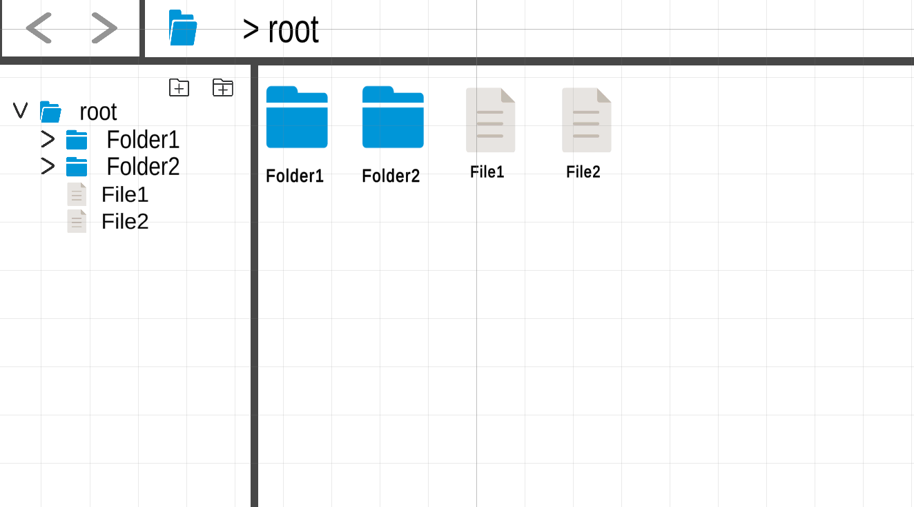
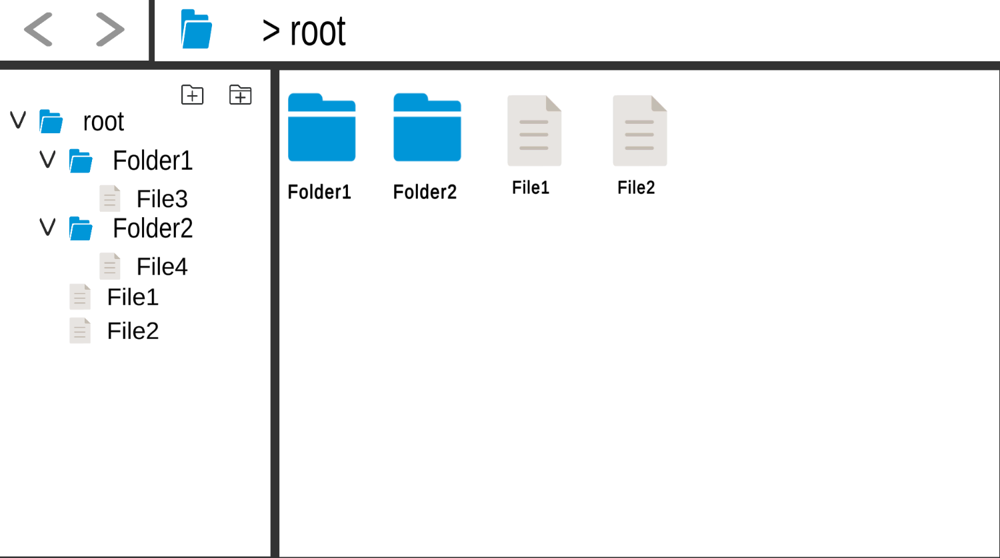
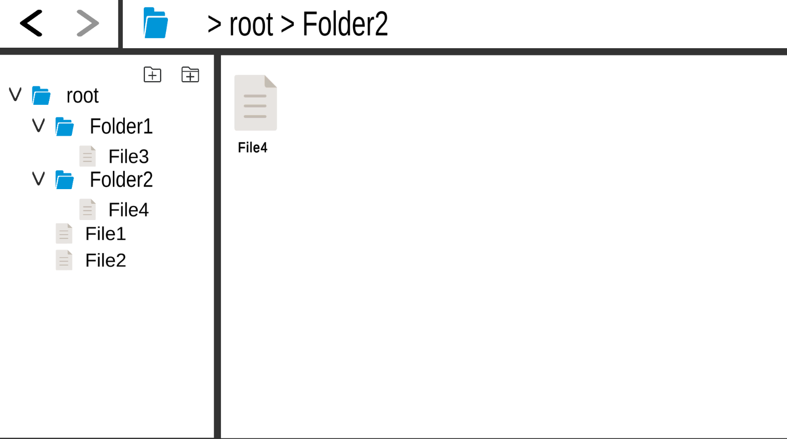
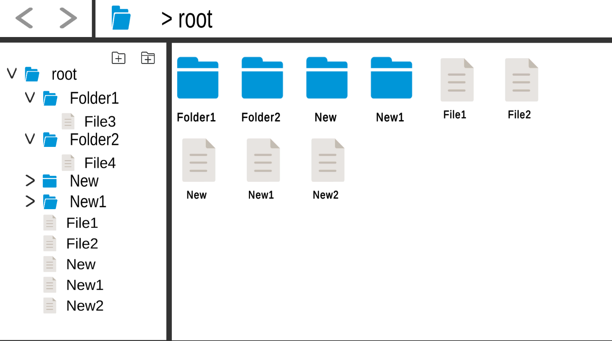
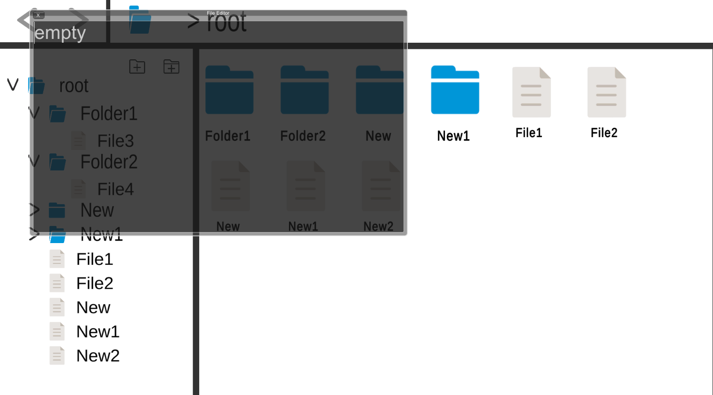
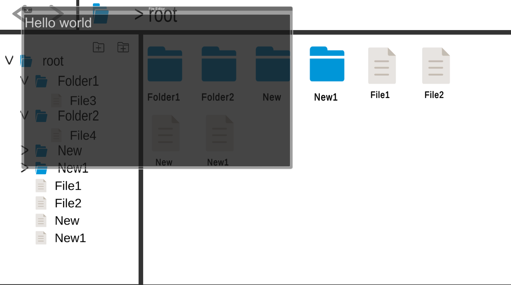
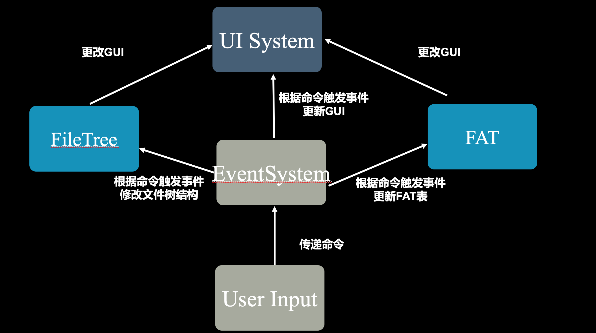

# 同济大学2023春 操作系统课程设计-文件系统

## 项目结构

```
Project3-FileManagement
├── FileManagement # 项目资源
│   └── Assets
│       ├──Prefabs   # Unity预制体
│       ├──Resources # 游戏资源
│       └──scripts   # C#脚本    
├── FileManagement-win
│   ├── FileManagement.exe #windows可执行文件
│   └── ...
├── FileManagement-mac.app   # macOS 应用程序
├── img      
└── README.md
```

## 基本任务

- 模拟常用操作系统文件管理系统功能
  - 磁盘文件访问

  - 进出文件目录

  - 新增文件/目录

  - 编辑文件内容

  - 保存修改到磁盘

- 实现用户友好界面，模拟具有GUI操作系统的界面设计
  - 界面划分：导航栏，目录路径，前进/后退按钮，主区域

  - 导航栏实现目录折叠/展开，展示文件树大纲

  - 目录路径展示当前路径

  - 前进/后退按钮对访问目录的历史进行回溯

  - 主区域列出当前目录下的文件和文件夹


## 核心数据结构

- FAT表：FAT表是一种表格形式的数据结构，用于管理磁盘上文件的分配和空闲情况。FAT表记录了磁盘上每个区块（通常是固定大小的扇区）的分配状态，以确定文件在磁盘上的物理位置。

- 文件树：文件树是一种树状结构，用于组织和表示文件系统中的文件和目录结构。它采用层级结构，由根目录开始，每个目录可以包含文件和子目录。文件树提供了一种直观的方式来浏览和访问文件系统中的文件和目录。每个节点代表一个文件或目录，节点之间通过父子关系连接。


## 开发和运行环境

- 开发平台：Unity 2021.3.17f1c1 LTS
- 开发语言：C# (.NET version 6.0.301)
- 运行环境：Windows/macOS（运行可执行文件无需安装依赖）

## 运行方法

clone项目至本地

```shell
git clone git@github.com:tju2050633/OperatingSystem.git
```

Windows:

进入/OperatingSystem/Project3-FileManagement/FileManagement-win/，双击打开FileManagement。

macOS：

进入/OperatingSystem/Project3-FileManagement/，双击打开FileManagement-mac.app。

## 运行截图



<center>主界面<center/>




<center>导航栏折叠/展开功能展示<center/>



<center>进入目录功能展示<center/>



<center>添加文件/文件夹功能展示<center/>



<center>文件编辑界面展示<center/>



<center>编辑完成保存到磁盘<center/>

## 架构设计




本项目基于Unity和C#开发，整体设计模式为面向对象的，主要对象为：

- User Input：接受用户输入，包括鼠标点击按钮和键盘输入文本。该对象将用户输入以命令（Command）的形式传递给EventSystem，从而触发相关Event。
- EventSystem：负责调用FileTree，FAT和UI System接口的核心类，接受来自用户输入的指令，通过事件机制指示系统进行一系列的更新操作，如修改GUI、修改文件树等。
- FileTree：存储目录结构的核心数据结构，采用层级结构，由根目录开始，每个目录可以包含文件和子目录，每个节点代表一个文件或目录，节点之间通过父子关系连接。主要负责被动地在Event触发时进行数据更改，同时在初始化后会调用UI System绘制初始界面。
- FAT：进行磁盘管理的核心数据结构。FAT表记录了磁盘上每个区块（通常是固定大小的扇区）的分配状态，以确定文件在磁盘上的物理位置。主要负责被动地在Event触发时进行数据更改，同时在初始化后会调用UI System绘制初始界面。

## 核心代码说明

1. File Tree实现文件目录树状结构

- File Tree采用单例类实现

- 类采用多叉树结构记录目录和文件，每个节点代表一个目录或文件，节点之间通过父子关系连接。
- 实现了一系列功能接口，如获取当前路径、进出目录、更新节点结构等。类内部的记录变量会被接口修改，随后Event System会调用UI System进行UI更新或调用FAT管理磁盘，它们根据File Tree的记录变量进行对应操作。例如，进出目录修改当前所处目录节点，则UI System根据该变量进行导航栏和主区域的重绘。

```c#
public class FileTree : MonoBehaviour
{
    // FAT
    public FAT fat;

    // 单例模式
    private static FileTree instance;

    public static FileTree Instance
    {
        get { return instance; }
    }

  	// 节点类
    public class Node;
    private Node root;
    private Node current;
  
  	// 当前路径记录
  	public Node GetCurrentDir();
    public List<Node> GetCurrentDirChildren();

  	// 目录进出方法
    public void EnterFolder(string name);
    public void Forward()
    public void Backward()
      
    // 节点结构更新方法
    public string AddNode(bool isFile);
  	public void DeleteNode(string name, bool isFile);
  	public void RenameNode(Node node, string name);
```


2. FAT

- FAT使用单例类实现
- FAT是管理文件分配和空闲磁盘空间的链表结构，设置为具有100个磁盘块、每块可以存100字节内容。FAT记录了每块的内容，next值为-1表示文件末尾、为-2表示块空，其他值为下一块的索引号。
- FAT初始化时，若能读取到磁盘内容，则加载磁盘内容，否则初始化为每个块内容为空，next值为-2.
- FAT实现了一系列功能接口，如对空闲块的获取和释放，文件的分配、查找和删除，磁盘的读写等。类内部的记录变量会被接口修改，随后Event System会调用UI System进行UI更新或File Tree更新目录树状结构，它们根据FAT的记录变量进行对应操作。执行删除文件操作后，删除事件触发，FAT被指示从磁盘将对应的块释放。

```c#

public class FAT : MonoBehaviour
{
    private const string disk_path = "Assets/disk.txt";  // 磁盘文件路径
    private const int BlockSize = 100;  // 每块大小为100字节
    private const int TotalBlocks = 100;  // FAT表总共有100个块

    private string[] content;  // 记录每块的内容
    private int[] next;  // 记录下一块的索引

    // FAT表初始化
    public void Init()
    {
        content = new string[TotalBlocks];
        next = new int[TotalBlocks];

        if (File.Exists(disk_path))
        {
            ReadDisk();
        }
        else
        {
            // 初始化FAT表和空闲块状态
            for (int i = 0; i < TotalBlocks; i++)
            {
                content[i] = "";
                next[i] = -2;
            }

            WriteDisk();
        }
    }

    // 获取空闲块
    public int GetAvailableBlock();

    // 释放块
    public void FreeBlock(int blockNumber);

    // 读取文件
    public List<int> GetFileBlocks(int startBlock);

    public string GetFileContent(int startBlock);

    // 写入文件
    public int AllocateFileBlocks(string content);

    // 删除文件
    public void DeleteFile(int startBlock);

    // 写入磁盘
    public void WriteDisk();

    // 从磁盘读取
    public void ReadDisk();
}
```

